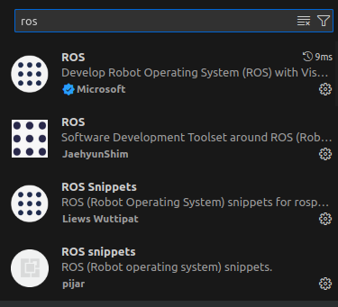
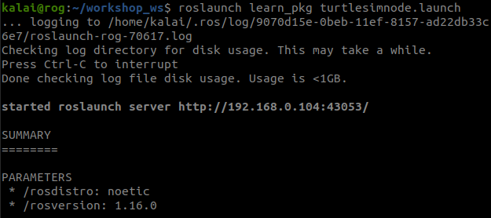
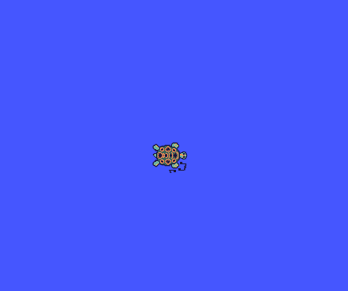

# roslaunch

roslaunch is used for starting many nodes at once.

roslaunch starts nodes as defined in a launch file.

` roslaunch [package] [filename.launch]`

Its good to make a launch directory for your launch file on your pakage file

```
mkdir launch
cd launch
```
The launch file components are

```
1. nodes launching
2. arguments
3. parameters
4. grouping
5. name spaces
6. if conditions
```

It will be helpful if we install 3 ros plugins



## basic launch file to run nodes

Example to run turtlesim_node we need to run `roscore and rosrun turtlesim turtlesim_node`

but using launch file we can run as one launch file (many nodes)
turtlesimnode.launch
```
<?xml version="1.0"?> 

<launch>

    <node pkg="turtlesim" type="turtlesim_node" name="mybot">
        
    </node>

</launch>
```





Even we can include teleop_key node

```
<?xml version="1.0"?> 

<launch>

    <node pkg="turtlesim" type="turtlesim_node" name="mybot">
        
    </node>
    <node pkg="turtlesim" type="turtle_teleop_key" name="key" />

</launch>

```

Now lets dig some thing more 

### arg 

`bringup_tbsim.launch`

```
<?xml version="1.0"?>
<launch>

    <arg name="name" default="turtle"/>
    <arg name="keyboard_name" default="keyboard"/>

    <node pkg="turtlesim" type="turtlesim_node" name="$(arg name)">
    </node>


    <node pkg="turtlesim" type="turtle_teleop_key" name="turtlesim_teleop_key">
        
    </node>

</launch>
```
create another file 
`dynamic_tbsim.launch`

```
<?xml version="1.0"?>
<launch>

    <include file="$(find learning_pkg)/launch/bringup_tbsim.launch">
        <arg name="name" value="tbsim_1"/>
        <arg name="keyboard_name" value="tbsim_kb_1"/>

    </include>

   <include file="$(find learning_pkg)/launch/bringup_tbsim.launch">
        <arg name="name" value="tbsim_2"/>
        <arg name="keyboard_name" value="tbsim_kb_2"/>
    
    </include>

    <include file="$(find learning_pkg)/launch/bringup_tbsim.launch">
        <arg name="name" value="tbsim_3"/>
        <arg name="keyboard_name" value="tbsim_kb_3"/>
 
    </include>

    <include file="$(find learning_pkg)/launch/bringup_tbsim.launch">
        <arg name="name" value="tbsim_4"/>
        <arg name="keyboard_name" value="tbsim_kb_4"/>
  
    </include>

    <include file="$(find learning_pkg)/launch/bringup_tbsim.launch">
        <arg name="name" value="tbsim_5"/>
        <arg name="keyboard_name" value="tbsim_kb_5"/>

    </include> 
</launch>
```

now you check `rosnode list` 
you can see multiple node list


