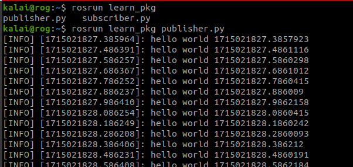
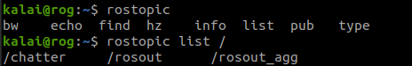
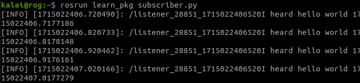
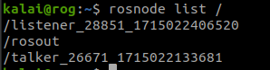
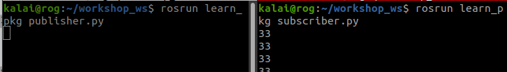
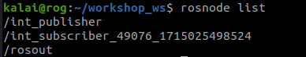
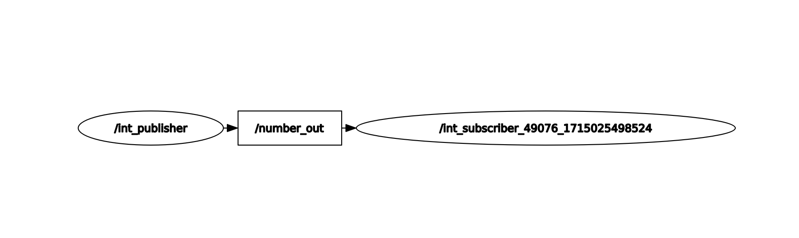
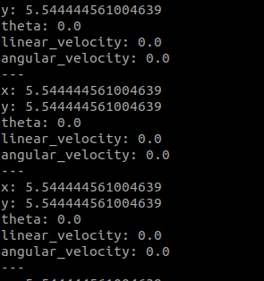
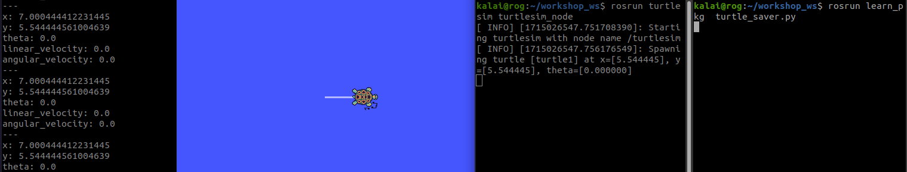

# Simple Publisher and Subscriber (Python)

First run `roscore`

use this commands for making the Publisher Node (publisher.py)


```
#!/usr/bin/env python3
# license removed for brevity
import rospy
from std_msgs.msg import String

def talker():
    pub = rospy.Publisher('chatter', String, queue_size=10)
    rospy.init_node('talker', anonymous=True)
    rate = rospy.Rate(10) # 10hz
    while not rospy.is_shutdown():
        hello_str = "hello world %s" % rospy.get_time()
        rospy.loginfo(hello_str)
        pub.publish(hello_str)
        rate.sleep()

if __name__ == '__main__':
    try:
        talker()
    except rospy.ROSInterruptException:
        pass

```

For the Subscriber Node (subscriber.py)

```
#!/usr/bin/env python3
import rospy
from std_msgs.msg import String

def callback(data):
    rospy.loginfo(rospy.get_caller_id() + "I heard %s", data.data)
    
def listener():

    # In ROS, nodes are uniquely named. If two nodes with the same
    # name are launched, the previous one is kicked off. The
    # anonymous=True flag means that rospy will choose a unique
    # name for our 'listener' node so that multiple listeners can
    # run simultaneously.
    rospy.init_node('listener', anonymous=True)

    rospy.Subscriber("chatter", String, callback)

    # spin() simply keeps python from exiting until this node is stopped
    rospy.spin()

if __name__ == '__main__':
    listener()
```

then use `rosrun learn_pkg publisher.py` you can find that your node publishing




To find what topic is publishing use `rostopic list /` 



Then to subscribe what you publish. use `rosrun learn_pkg subscriber.py `



Here you can see the data published by publisher.

To see the node activated for use 




## Simple Publisher and Subscriber (Python) for our use (addition two ints)


use this commands for making the Publisher Node (publisher.py)

```
#!/usr/bin/env python3

import rospy
from std_msgs.msg import Int16

def number_publisher():
    pub = rospy.Publisher('number_out', Int16, queue_size=10)
    rospy.init_node('int_publisher')
    rate = rospy.Rate(10)
    while not rospy.is_shutdown():
        num_msg = 23

        pub.publish(num_msg)
        rate.sleep()

if __name__ == '__main__':
    try:
        number_publisher()
    except rospy.ROSInterruptException:
        pass

```
For the Subscriber Node (subscriber.py)

```
#!/usr/bin/env python3
import rospy
from std_msgs.msg import Int16

def callback(data):
    #data(data:23) and data.data (23)
    number = data.data
    number = number  + 10
    print(number)


def listener():


    rospy.init_node('int_subscriber', anonymous=True)

    rospy.Subscriber("number_out", Int16, callback)

    # spin() simply keeps python from exiting until this node is stopped
    rospy.spin()

if __name__ == '__main__':
    listener()

```
Use `rosrun learn_pkg publisher.py` for publisher
and use ` rosrun learn_pkg subscriber.py` for subscriber

Here you can see that number=23 from publisher is getting added (number = number  + 10) with 10 from subscriber and return 33



we can see the active node list by using `rosnode list`



By using `rqt_graph` we can see nodes and the topics  and how data transfer



# One single file for publisher and subscriber

This one .py file where turtlesim node is used. this code helps tuttle1 to not to hit wall

```
#!/usr/bin/env python3
import rospy
from geometry_msgs.msg import Twist
from turtlesim.msg import Pose

class vel_manipulator:

    def __init__(self):
        pub_topic_name ="/turtle1/cmd_vel"
        sub_topic_name ="/turtle1/pose"

        self.pub = rospy.Publisher(pub_topic_name, Twist, queue_size=10)
        self.number_subscriber = rospy.Subscriber(sub_topic_name, Pose, self.pose_callback)
        self.velocity_msg = Twist()

    def pose_callback(self, msg):
        if (msg.x  >= 7):
            ## stopping condition
            self.velocity_msg.linear.x = 0
        else :
            self.velocity_msg.linear.x = 0.5


        self.pub.publish(self.velocity_msg)


if __name__ == '__main__':
    node_name ="Turtle_Saver"
    rospy.init_node(node_name)
    vel_manipulator()
    rospy.spin()
```

If you use `rostopic echo /turtle1/pose` we can find the pose of turtlesim



Here you can see after running turtle saver file 



