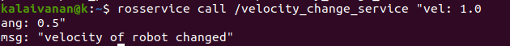

# ROS Service & Client (Python3)

rosservice list         print information about active services
rosservice call         call the service with the provided args
rosservice type         print service type
rosservice find         find services by service type
rosservice uri          print service ROSRPC uri


If you enter `rosservice` and tab 


### commands  and its uses

rosservice list         print information about active services
rosservice call         call the service with the provided args
rosservice type         print service type
rosservice find         find services by service type
rosservice uri          print service ROSRPC uri

### create pkg

` mkdir service_pkg `

 then you will find a service pkg file

 ` catkin_create_pkg service_pkg std_msgs rospy`

 ```
 # This is an example, do not try to run this
# catkin_create_pkg <package_name> [depend1] [depend2] [depend3]
```
on the workspace we need to use this cmd `catkin_make` for activation

# Empty service

## create an .py file  for empty service 

 ``` 
 #!/usr/bin/env python3

from std_srvs.srv import Empty, EmptyResponse
import rospy

def empty_response(req):
    print("Returning empty response_answer.")
    return EmptyResponse()

if __name__ == "__main__":

    rospy.logwarn("This is a warning")
    rospy.init_node('empty_srv')

    s = rospy.Service('print_srv', Empty, empty_response)
    #service name , service type(srv-file) , callback function (response)
    
    
    print("service started ")
    print("Ready to print empty response.")
    rospy.spin()
```
activate it for run by using 

` chmod +x * `

on your location
 you will see this 
 result where your server is activated

`rosrun service_pkg empty_srv.py`


now you can check your server is there is activated or not 

using 
`rosservice list `


And we can call that available service using call command 
`rosservice call /print_srv "{}" `

Then you will see the response output in server terminal


## An automatic service  for turtle sim using Empty service

Excute turtlesim node 

create .py file using below cmd for creating service file


```
#!/usr/bin/env python3

from std_srvs.srv import Empty, EmptyResponse
from geometry_msgs.msg import Twist
import rospy

def empty_response(req):
    vel_msg = Twist()
    for i in range(15):
        vel_msg.linear.x = 1
        vel_msg.angular.z = 0.5
        pub.publish(vel_msg)
        rate.sleep()
    print("Returning empty response_answer.")
    return EmptyResponse()

if __name__ == "__main__":
    rospy.logwarn("This is a warning")
    rospy.init_node('empty_srv')
    pub = rospy.Publisher("/turtle1/cmd_vel", Twist, queue_size=10) 
   
    s = rospy.Service('rotate_turtle_srv', Empty, empty_response)

    print("Ready to return empty response.")
    rate = rospy.Rate(1)

    rospy.spin()

```
to start service use 
`rosrun service_pkg srv_ex2.py`


To call the service for task use `rosservice call /rotate_turtle_srv"{}"`

Now you can see your bot doing specified actions


## service and client for add 2 ints


addition.srv

```
int64 x
int64 y
---
int64 result
```

add_server.py

```
#!/usr/bin//env python3

import rospy
from service_pkg.srv import addition, additionResponse

def server_cb(req):
    #response of add_server
    return additionResponse(req.x + req.y)

if __name__ == "__main__":
    rospy.init_node('addition_server')
    s = rospy.Service('add_ints', addition, server_cb)
    print("Ready to add_ints.")
    rospy.spin()
```
### CMakeLists.txt & package.xml file changes for utilizing srv file

Add this cmd on package.xml file

```
  <build_depend>message_generation</build_depend>
  <exec_depend>message_runtime</exec_depend>
```
Add on CMakeLists.txt

```
# Do not just add this line to your CMakeLists.txt, modify the existing line
find_package(catkin REQUIRED COMPONENTS
  roscpp
  rospy
  std_msgs
  message_generation
)
```
```
add_service_files(
  FILES
  addition.srv
)
```

Then to make excituable use 
`catkin_make`

use this cmd `rossrv show service_pkg/addition` for visualize our srv file requests and response

where client use response and server use request


The client file 

```
#!/usr/bin/env python3

import sys
import rospy
from service_pkg.srv import addition, additionResponse


def add_two_ints_client(x, y):
    rospy.wait_for_service('add_ints')

    add_int = rospy.ServiceProxy('add_ints', addition)
    #service proxy - enter the service name and srv file name
    #we need to write service name and srv file name

    resp = add_int(a, b) # xy, can change to any name

    print(resp.result)

if __name__ == "__main__":
    x = int(sys.argv[1])
    y = int(sys.argv[2])
    add_two_ints_client(x, y)
```
`rosrun service_pkg add_server.py`


`rosrun service_pkg add_client.py 1 2`


## velocity of bot example

create a velocity.srv file 
```
float32 vel
float32 ang
---
string msg
```

```
add_service_files(
  FILES
  addition.srv
  velocity.srv
)
```

Then to make excituable use 
`catkin_make`

### vel_server_node.py for changing velocity of bot.

```
#!/usr/bin/env python3
import rospy
from geometry_msgs.msg import Twist
from turtlesim.msg import Pose
from service_pkg.srv import velocity, velocityResponse

class vel_server:
    def __init__(self):
        pub_topic_name = '/turtle1/cmd_vel'
        sub_topic_name = '/turtle1/pose'
        self.pub = rospy.Publisher(pub_topic_name, Twist, queue_size=10)
        self.sub = rospy.Subscriber(sub_topic_name, Pose, self.pose_callback)
        self.service = rospy.Service('velocity_change_service', velocity, self.velo_cb)
        self.velocity_msg = Twist()
        # self.pose = Pose()
        # self.rate = rospy.Rate(1)

    def velo_cb(self, req):
        self.velocity_msg.linear.x = req.vel
        self.velocity_msg.angular.z = req.ang
        return "velocity of robot changed"


    def pose_callback(self, msg):
        self.pub.publish(self.velocity_msg)

if __name__ == '__main__':
    rospy.init_node('turtle_vel_test')
    vel_server()
    rospy.spin()
```
`rosrun service_pkg vel_server_node.py`


`rosservice call /velocity_change_service `




