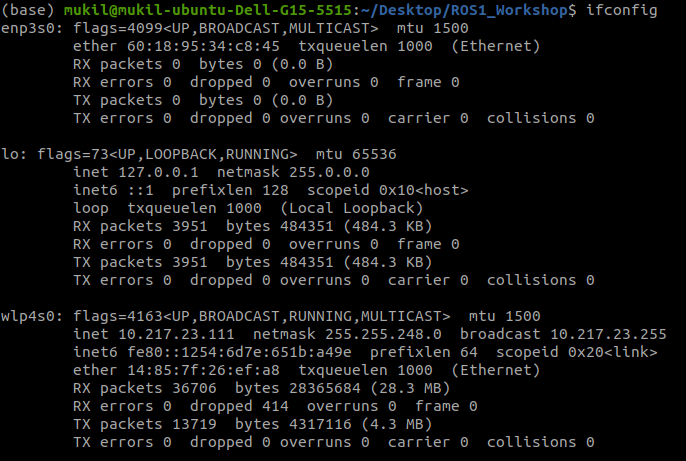

# Turtlebot3 Simulation Installation 

## Install Dependent ROS Packages

``` 
$ sudo apt-get install ros-noetic-joy ros-noetic-teleop-twist-joy \
ros-noetic-teleop-twist-keyboard ros-noetic-laser-proc \
ros-noetic-rgbd-launch ros-noetic-rosserial-arduino \
ros-noetic-rosserial-python ros-noetic-rosserial-client \
ros-noetic-rosserial-msgs ros-noetic-amcl ros-noetic-map-server \
ros-noetic-move-base ros-noetic-urdf ros-noetic-xacro \
ros-noetic-compressed-image-transport ros-noetic-rqt* ros-noetic-rviz \
ros-noetic-gmapping ros-noetic-navigation ros-noetic-interactive-markers
```
    

## Install TurtleBot3 Packages

Install TurtleBot3 via Debian Packages.

```
$ sudo apt install ros-noetic-turtlebot3-msgs
$ sudo apt install ros-noetic-turtlebot3
```  

(Click on drop-down icon to expand, in case you need to download the source codes and build them)

<details>
<summary>Installing packages from source</summary>
Make sure to remove the identical packages to avoid redundancy.

```
    $ sudo apt remove ros-noetic-dynamixel-sdk
    $ sudo apt remove ros-noetic-turtlebot3-msgs
    $ sudo apt remove ros-noetic-turtlebot3
    $ mkdir -p ~/catkin_ws/src
    $ cd ~/catkin_ws/src/
    $ git clone -b noetic-devel https://github.com/ROBOTIS-GIT/DynamixelSDK.git
    $ git clone -b noetic-devel https://github.com/ROBOTIS-GIT/turtlebot3_msgs.git
    $ git clone -b noetic-devel https://github.com/ROBOTIS-GIT/turtlebot3.git
    $ cd ~/catkin_ws && catkin_make
    $ echo "source ~/catkin_ws/devel/setup.bash" >> ~/.bashrc
```
</details>

</br>

## Network Configuration

1.  Connect PC to a WiFi device and find the assigned IP address with the command below.
    
```
$ ifconfig
``` 


    
2.  Open the file and update the ROS IP settings with the command below.
```
$ nano ~/.bashrc
```      
    
3.  Move the cursor to the end of line. Insert the below script for `ROS_MASTER_URI` and `ROS_HOSTNAME`.

```
export ROS_MASTER_URI=http://localhost:11311
export ROS_HOSTNAME=localhost
```
    
4.  Source the bashrc with below command.
    
```
$ source ~/.bashrc
```

## Install Simulation Package
The TurtleBot3 Simulation Package requires `turtlebot3` and `turtlebot3_msgs` packages as prerequisite. Without these prerequisite packages, the Simulation cannot be launched.

```
$ cd ~/catkin_ws/src/
$ git clone -b noetic-devel https://github.com/ROBOTIS-GIT/turtlebot3_simulations.git
$ cd ~/catkin_ws && catkin_make
```

## Export `TURTLEBOT3_MODEL`

Insert the below script in  `~/.bashrc`

```
$ export TURTLEBOT3_MODEL=burger
```


# Reference
--------
[1] [Installation of Turtlebot3 Simulation](https://emanual.robotis.com/docs/en/platform/turtlebot3/quick-start/)
