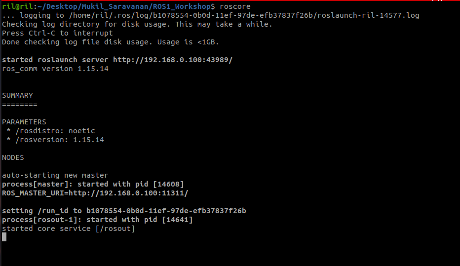
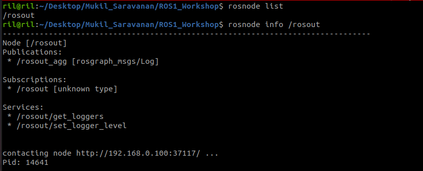
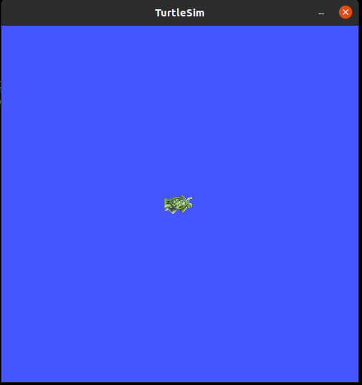
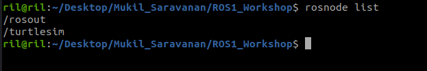
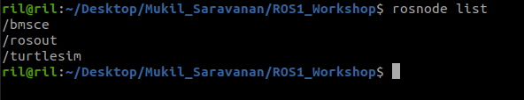

# Understand ROS Node with Turtlesim

`roscore` is the first thing you should run when using ROS.

Please run:

```
$ roscore
```

You will see something similar to:



Using rosnode
-------------

Open up a **new terminal**, and let's use **rosnode** to see what running roscore did... Bear in mind to keep the previous terminal open either by opening a new tab or simply minimizing it.

**Note:** When opening a new terminal your environment is reset and your `~/.bashrc` file is sourced. If you have trouble running commands like rosnode then you might need to add some environment setup files to your `~/.bashrc` or manually re-source them.

rosnode displays information about the ROS nodes that are currently running. The rosnode list command lists these active nodes:
```
$ rosnode list
```

This will show us that there is only one node running: `/rosout`. This is always running as it collects and logs nodes' debugging output.

The rosnode info command returns information about a specific node.

```
$ rosnode info /rosout
```

This gave us some more information about rosout, such as the fact that it publishes `/rosout_agg`.



Now, let's see some more nodes. For this, we're going to use rosrun to bring up another node.

Using rosrun
------------

`rosrun` allows you to use the package name to directly run a node within a package (without having to know the package path).
So now we can run the `turtlesim_node` in the turtlesim package.

Then, in a **new terminal**:
```
$ rosrun turtlesim turtlesim_node
```
You will see the turtlesim window:


    

In a **new terminal**:
```
$ rosnode list
```
You will see something similar to:


    

One powerful feature of ROS is that you can reassign Names from the command-line.

Close the turtlesim window to stop the node (or go back to the rosrun turtlesim terminal and use ctrl-C). Now let's re-run it, but this time use a Remapping Argument to change the node's name:

```
$ rosrun turtlesim turtlesim_node __name:=bmsce
```

Now, if we go back and use rosnode list:
```
$ rosnode list
```



Note: If you still see `/turtlesim` in the list, it might mean that you stopped the node in the terminal using ctrl-C instead of closing the window, or that you don't have the `$ROS_HOSTNAME` environment variable defined as described in [Network Setup - Single Machine Configuration](http://www.ros.org/wiki/ROS/NetworkSetup#Single_machine_configuration). You can try cleaning the rosnode list with: `$ rosnode cleanup`

We see our new `/my_turtle node`. Let's use another rosnode command, ping, to test that it's up:
```
$ rosnode ping my_turtle
```


## Reference
-------
[1] [Understanding ROS Nodes](http://wiki.ros.org/ROS/Tutorials/UnderstandingNodes)
