# Understand ROS Topic with Turtlesim

## roscore

Let's start by making sure that we have roscore running, **in a new terminal**:

```
$ roscore
```

If you left roscore running from the last tutorial, you may get the error message:

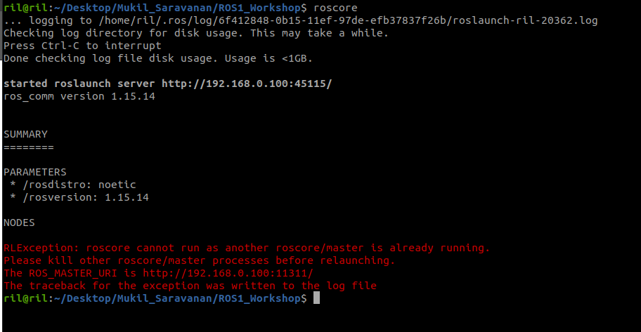
    

This is fine. Only one roscore needs to be running.

## turtlesim

For this tutorial we will also use turtlesim. Please run **in a new terminal**:

```
$ rosrun turtlesim turtlesim_node
```

## turtle keyboard teleoperation

We'll also need something to drive the turtle around with. Please run **in a new terminal**:

```
$ rosrun turtlesim turtle_teleop_key
```

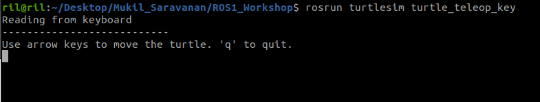
    

Now you can use the arrow keys of the keyboard to drive the turtle around. If you can not drive the turtle **select the terminal window of the turtle_teleop_key** to make sure that the keys that you type are recorded.

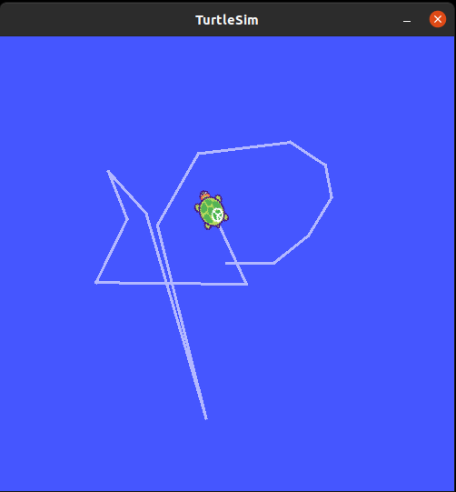
    

Now that you can drive your turtle around, let's look at what's going on behind the scenes.

## ROS Topics
----------

The `turtlesim_node` and the `turtle_teleop_key` node are communicating with each other over a ROS **Topic**. `turtle_teleop_key` is **publishing** the key strokes on a topic, while turtlesim **subscribes** to the same topic to receive the key strokes. Let's use `rqt_graph` which shows the nodes and topics currently running.

## Using rqt_graph

`rqt_graph` creates a dynamic graph of what's going on in the system. `rqt_graph` is part of the rqt package.

**In a new terminal**:
```
$ rosrun rqt_graph rqt_graph
```


If you place your mouse over `/turtle1/command_velocity` it will highlight the ROS nodes (here blue and green) and topics (here red). As you can see, the `turtlesim_node` and the `turtle_teleop_key` nodes are communicating on the topic named `/turtle1/command_velocity`.

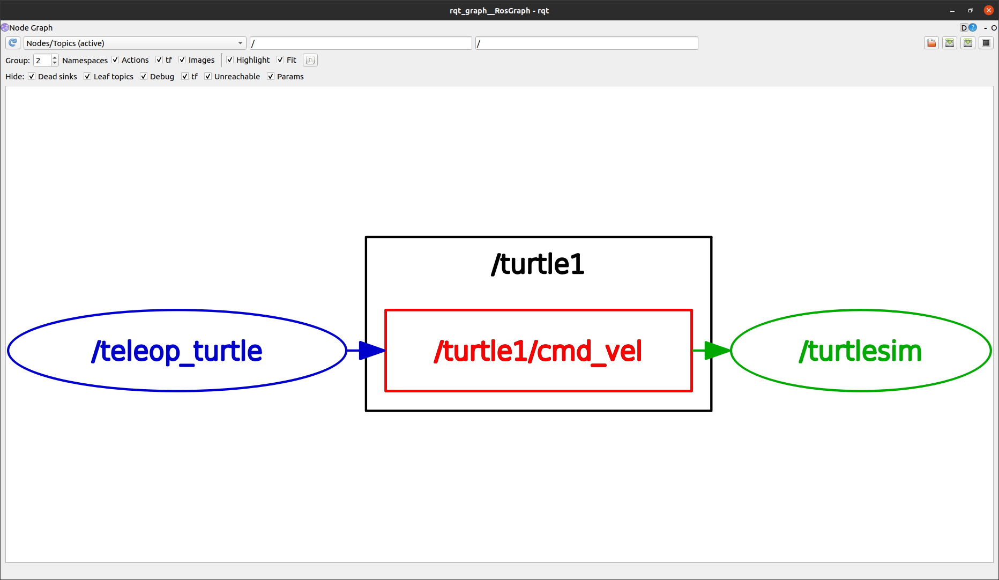

## Introducing rostopic

The rostopic tool allows you to get information about ROS **topics**.

You can use the help option to get the available sub-commands for rostopic

```
$ rostopic -h
```
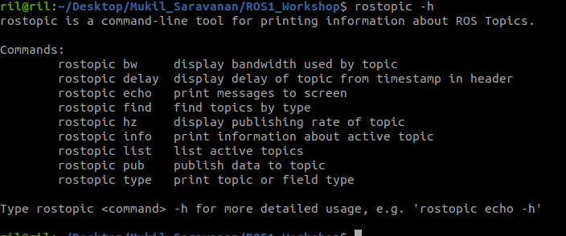

Let's use some of these topic sub-commands to examine turtlesim.

## Using rostopic echo

`rostopic echo` shows the data published on a topic.

Let's look at the command velocity data published by the `turtle_teleop_key` node.

_For ROS Hydro and later,_ this data is published on the `/turtle1/cmd_vel` topic. **In a new terminal, run:**

```
$ rostopic echo /turtle1/cmd_vel
```

You probably won't see anything happen because no data is being published on the topic. Let's make `turtle_teleop_key` publish data by pressing the arrow keys. **Remember if the turtle isn't moving you need to select the turtle_teleop_key terminal again.**

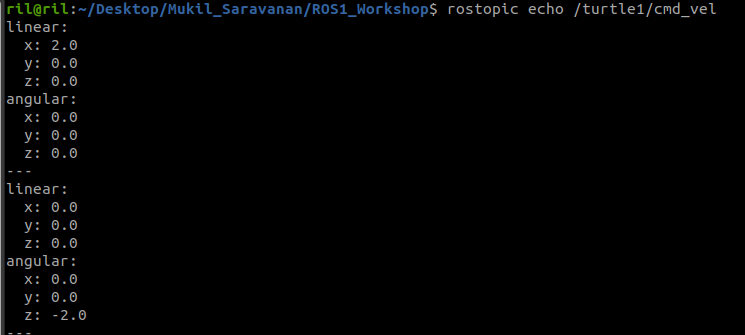

Now let's look at `rqt_graph` again. Press the refresh button in the upper-left to show the new node. As you can see rostopic echo, shown here in red, is now also **subscribed** to the `turtle1/cmd_vel` topic.

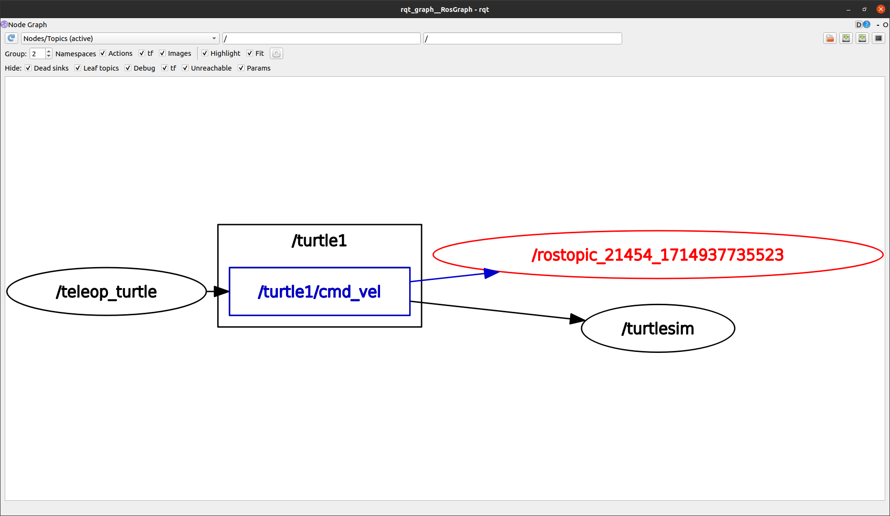

## Using rostopic list

`rostopic list` returns a list of all topics currently subscribed to and published.

Let's figure out what argument the list sub-command needs. In a **new terminal** run:
```
$ rostopic list -h
```
For rostopic list use the **verbose** option:
```
$ rostopic list -v
```
This displays a verbose list of topics to publish to and subscribe to and their type.

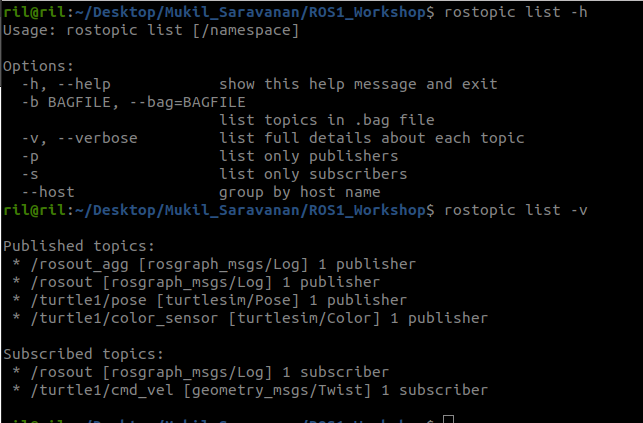

ROS Messages
------------

Communication on topics happens by sending ROS **messages** between nodes. For the publisher (`turtle_teleop_key`) and subscriber (`turtlesim_node`) to communicate, the publisher and subscriber must send and receive the same **type** of message. This means that a topic **type** is defined by the message **type** published on it. The **type** of the message sent on a topic can be determined using rostopic type.

### Using rostopic type

`rostopic type` returns the message type of any topic being published.

Try:
    
```
$ rostopic type /turtle1/cmd_vel
```

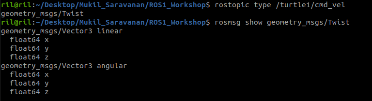   

        
    
We can look at the details of the message using `rosmsg`:

```
$ rosmsg show geometry_msgs/Twist
$ rostopic type /turtle1/command_velocity
```

   
        

Now that we know what type of message turtlesim expects, we can publish commands to our turtle.

Now that we have learned about ROS **messages**, let's use rostopic with messages.

## Using rostopic pub

rostopic pub publishes data on to a topic currently advertised.

```
$ rostopic pub -1 /turtle1/cmd_vel geometry_msgs/Twist -- '[2.0, 0.0, 0.0]' '[0.0, 0.0, 1.8]'
```

The previous command will send a single message to turtlesim telling it to move with a linear velocity of 2.0, and an angular velocity of 1.8 .

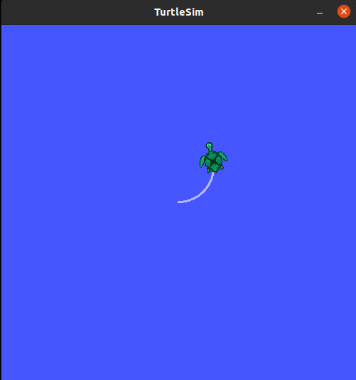  
    
    
You may have noticed that the turtle has stopped moving; this is because the turtle requires a steady stream of commands at 1 Hz to keep moving. We can publish a steady stream of commands using rostopic pub -r command:

```
$ rostopic pub /turtle1/cmd_vel geometry_msgs/Twist -r 1 -- '[2.0, 0.0, 0.0]' '[0.0, 0.0, -1.8]'
```    

This publishes the velocity commands at a rate of 1 Hz on the velocity topic.    

We can also look at what is happening in `rqt_graph`. Press the refresh button in the upper-left. The rostopic pub node (here in red) is communicating with the rostopic echo node (here in green):

As you can see the turtle is running in a continuous circle. In a **new terminal**, we can use rostopic echo to see the data published by our turtlesim:

```
$ rostopic echo /turtle1/pose
```

### Using rostopic hz

`rostopic hz` reports the rate at which data is published.

Let's see how fast the `turtlesim_node` is publishing `/turtle1/pose`:

```
$ rostopic hz /turtle1/pose
```

You will see:

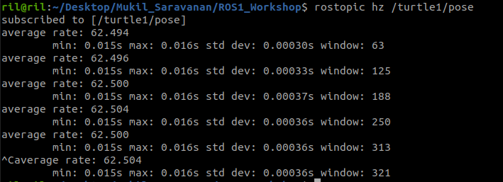  
    

Now we can tell that the turtlesim is publishing data about our turtle at the rate of 60 Hz. We can also use rostopic type in conjunction with rosmsg show to get in depth information about a topic:

That's it for this section, use Ctrl-C to kill the rostopic terminals but keep your turtlesim running.

Now that you understand how ROS topics work.

## Reference
-------
[1] [Understanding ROS Topic](http://wiki.ros.org/ROS/Tutorials/UnderstandingTopics)
