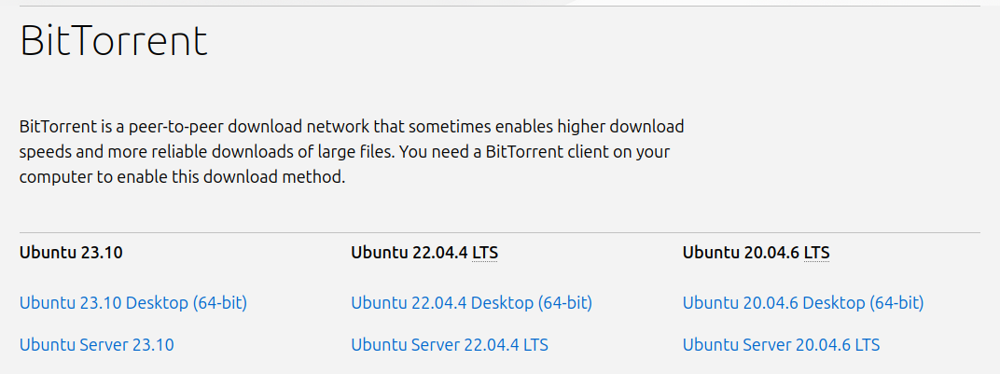
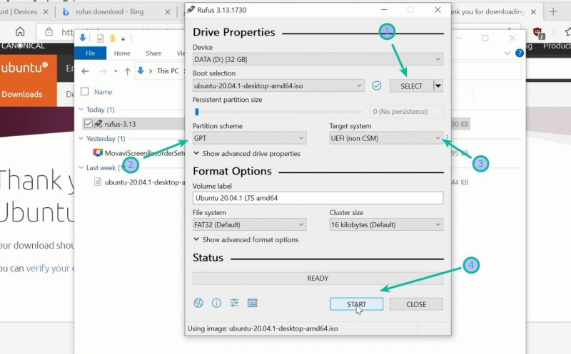
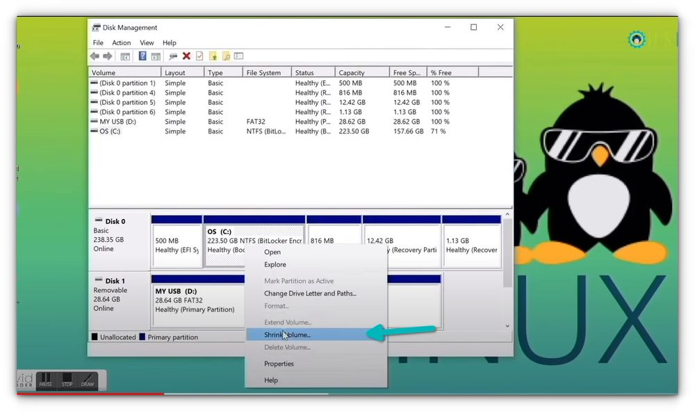
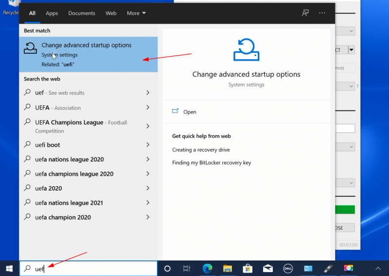
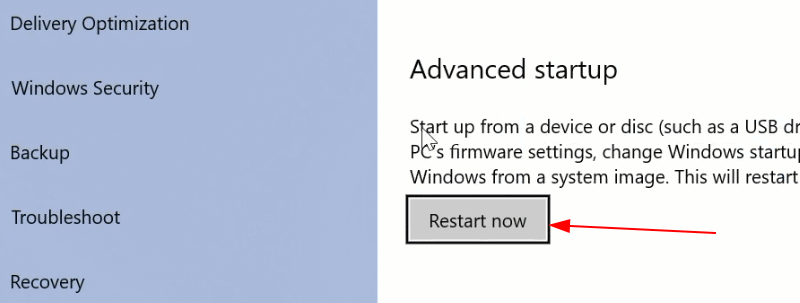
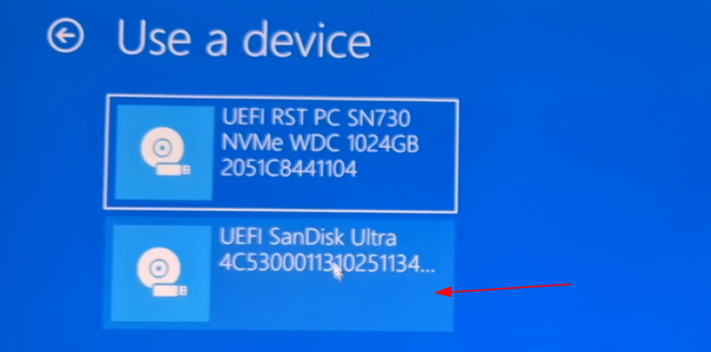
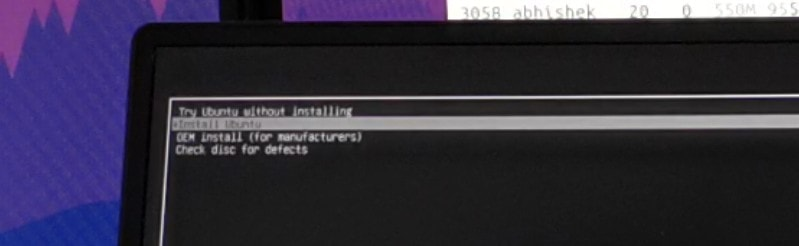

# **Dual Booting Ubuntu 20.04**

### **Prerequisites:**

- Windows PC/laptop with below mentioned specifications
- Pendrive (16 GB or more)
- Stable internet connection

### **PC requirements:**

- Processor:
  - **Minimum:** Intel i3/ Ryzen 3
  - **Recommended:** Intel 5/Ryzen 5 or later
- RAM:
  - **Minimum:** 4 GB
  - **Recommended:** 8 GB
- Disk Space:
  - **Minimum:** 30 GB
  - **Recommended:** 50 GB
- Dedicated GPU is preferred for faster rendering of simulations (Don’t worry if your PC doesn’t have one. It works fine without it too)

Now that, you are ready to install dual boot Ubuntu 20.04 alongside Windows 10/11

### **Procedure:**

(Click on drop-down icon to expand a section)

1. Download Ubuntu 20.04 ISO file

Head over to [Ubuntu’s website](https://ubuntu.com/download/alternative-downloads) and download the **'Ubuntu 20.04.6 Desktop (64-bit)'** ISO file. The file should be around 2.5 GB in size.

2. Create a live USB disk of Ubuntu

<par>
I presume that you are using Windows to create the live USB. Several free applications allow you to create a live Ubuntu USB. You can use any of these tools. Since I cannot show all of them, I’ll go with Rufus.

Download Rufus for free from its [website](https://rufus.ie/en/). It will download a .exe file.

Plug in your USB. This device will be formatted so make sure you don’t have any important data on this USB disk.

Run the Rufus tool you just downloaded. It automatically identifies the plugged-in USB but double-check it anyway. Now, browse to the location of the downloaded ISO image and ensure that it uses GPT partitioning scheme and UEFI target system.
</par>

Hit the start button and wait for the process to complete. Your live Linux USB is ready.

3. Partitioning the drive

In the Windows menu, search for **'disk partitions'** and go to **'Create and format hard disk partitions.'**

In the Disk Management tool, right-click on the drive which you want to partition and select shrink volume.

If you have just one partition like this, you need to make some free space out of it for Linux. Use any of them except C drive if you have several partitions of considerable size because it may erase the data.

The 256 GB in my system already had several partitions from the manufacturer but mainly for backup and other purposes. The primary partition was the C drive, around 220 GB, where Windows 10 is installed. In my case, I shrank the C drive to make some free space for Linux installation.

**How much space do you need for Linux in dual boot?**

This depends on how much total disk space you have. You may install Ubuntu on 15 or 20 GB but you’ll soon start running out of disk space. These days, you should have at least 120 GB of disk. In that case, go for 30-40 GB of disk for Linux. If you have 250 GB disk, allocate 60-80 GB or even more. If you have more disk space, allocate even more free space, if you want.

**What if you have D, E or F drives?**

This is a common confusion for many people as they think Ubuntu can only be installed on the C drive. That’s not true. I had only one C drive, so I shrank it. If you have D, E or F drive, you may shrink one of those drives. You may also choose to delete the D, E or F drive. **NEVER DELETE C DRIVE.**

4. Boot from live Ubuntu USB

You created a live Ubuntu USB in step 2. Plug it into the system. Before you go and boot from the live USB by doing the following. In the Windows menu, search for UEFI and then click on ‘Change advanced startup options’

Go to the Advanced startup option and click on Restart now button.

On the next screen, click on ‘Use a device’

Recognize the USB disk with its name and size. It may also be displayed as **EFI USB Device.**

Now it will power off your system and reboot into the disk you chose which should be the live USB disk. You should see a screen like this after a few seconds

The **‘Try Ubuntu without installing’** option allows you to experience Ubuntu from the live disk. The option to install Ubuntu can be found on the desktop.

The **'Install Ubuntu'** option will start the Ubuntu installation immediately.

You can opt for either option based on your preference.

5. Install Ubuntu alongside with Windows

Start the installation procedure. The first few steps are simple. You choose the language and keyboard layout.

On the next screen, choose **'Normal installation'** without installing other third parties applications.

Hit continue. It may take some time to go to the next step.

Click on **'Something Else'** and continue

Select the free space and click on the + sign.

It will provide you with the option to create a Linux partition. You are creating the Root partition. Anything above 25 GB is more than sufficient for it. Choose the size, select Ext 4 as the file type and / (means root) as the mount point.

Clicking on OK in the previous step will bring you to the partition screen. Next, create a swap. Like previously, click on the + sign again. This time, use the file type as the Swap area. If you have 2 GB or less RAM, use swap double the size of RAM. If you have 3-6 GB of RAM, use a swap of the same size as RAM. If you have 8 GB or more RAM, you may use swap half the size of RAM (unless you have plenty of disk space, and you want to use hibernation and in that case, use a swap of at least the same size as RAM).

Similarly, create a Home partition. Allocate it maximum space (in fact allocate it the rest of the free space) because this is where you’ll save music, pictures and downloaded files.

Once you are ready with Root, Swap and Home, click on Install Now

Proceed forward with selecting timezone and click continue.

Next, you’ll be asked to enter a username, hostname (computer’s name) and password.

Now you need to wait for some minutes to complete the installation.

Once the installation finishes, restart the system.

If everything goes smoothly, you should see the grub screen once the system powers on. 
Here, you can choose Ubuntu to boot into Ubuntu and Windows boot manager to boot into Windows.

Hurray! You have sucessfully installed Ubuntu 20.04 alongside Windows 10/11.
Now, you are all set to fly with me to learning ROS1.

 

### **References:**
1. [Official Ubuntu Installation](https://ubuntu.com/tutorials/install-ubuntu-desktop#1-overview) 
2. [Beginners Guide to Install Windows With Ubuntu in Dual Boot](https://itsfoss.com/install-ubuntu-1404-dual-boot-mode-windows-8-81-uefi/)
3. [Video Tutorial - Dual Boot Ubuntu](https://www.youtube.com/watch?v=u5QyjHIYwTQ&ab_channel=It%27sFOSS-LinuxPortal) 